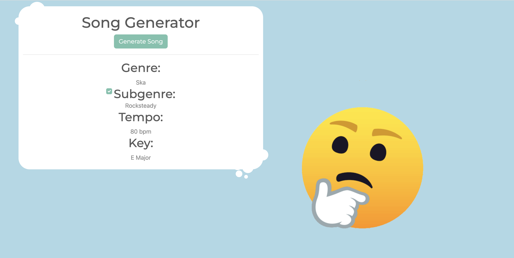

# Song Generator

The Song Generator project is designed to help musicians and songwriters find inspiration and get their creative juices flowing. It provides a framework for generating a song idea based on genre, subgenre, tempo, and key.

## Installation

To use the Song Generator project, you can find it live on the [Github Page](https://katene30.github.io/song-generator/). If you prefer to use it on your local machine, simply clone it down with:

` git clone https://github.com/katene30/song-generator.git `

Then open up the `index.html` file.

## Usage

The Song Generator provides you with a genre, subgenre, tempo, and key. You can uncheck the subgenre if you only want to work with the main one, otherwise, challenge yourself and include it.

## Example

Here's a screenshot of an example generated song:

## Contributing

If you wish to contribute to the Song Generator project or report any bugs, please make a branch and apply for a pull request. All feedback is welcome.

## Authors

- katene

## Stretch Goals

- Reshuffle Subgenre
- Add another genre to mix with
